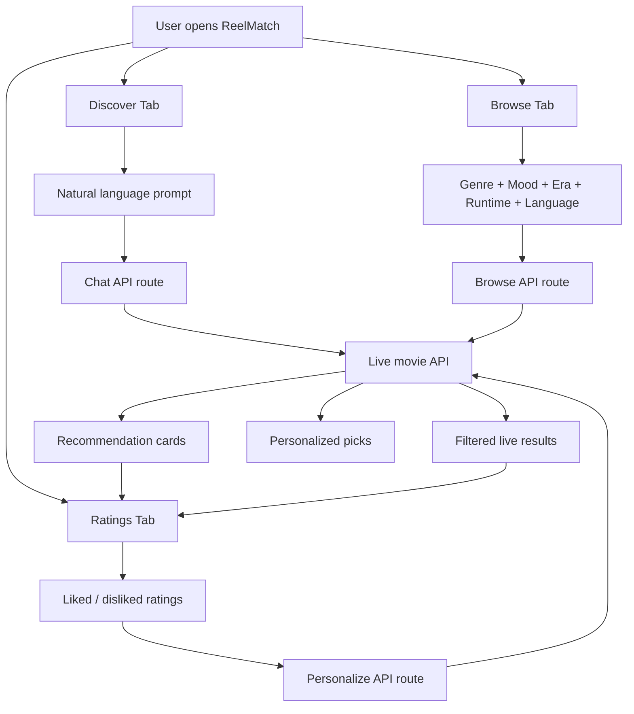

# 🎬 ReelMatch

> A cinematic movie recommendation app built with Next.js for live discovery, mood-based browsing, shared ratings, and personalized picks.

## ✨ What Is ReelMatch?

ReelMatch is designed to feel less like a database and more like a movie concierge.

Users can:

- 💬 describe a vibe in natural language
- 🎭 browse movies using layered filters
- ⭐ rate movies from anywhere in the app
- 🧠 get personalized recommendations based on taste
- 🍿 eventually see where a movie is available to watch

---

## 🚀 Vision

ReelMatch should feel:

- Luxurious
- Cinematic
- Fast
- Personal
- Smart

Instead of making users search like a spreadsheet, the app should help them say things like:

> "Something like Inception but lighter"

or

> "A recent emotional movie under 2 hours"

and quickly get strong suggestions.

---

## 🧩 Core Features

### 1. 💬 AI Chat Discovery

- Users type natural-language requests
- The system returns a small set of tailored movie recommendations
- Conversation context can be reused for follow-up refinement
- Quick suggestion chips help users get started faster

### 2. 🎛️ Filter-Based Browse

Users can browse movies across five dimensions:

| Filter | Examples |
|---|---|
| Genre | Action, Comedy, Drama, Horror, Sci-Fi |
| Mood | Feel-good, Mind-bending, Emotional, Intense |
| Era | 1970s-1980s, 1990s-2000s, 2010s, 2020s |
| Runtime | Under 100 min, 100-130 min, 130+ min |
| Language | English, Korean, Japanese, French, Spanish |

### 3. ⭐ Ratings System

- Rate movies from chat cards
- Rate movies from browse results
- Manually log titles you have watched
- Keep liked vs disliked patterns in one shared session state

### 4. 🧠 Personalized Recommendations

- Uses user ratings as the taste profile
- Separates liked and disliked movies
- Returns recommendation cards with why-they-match explanations

### 5. 🌐 Live Data Goal

The product should rely on live external movie data, not a hardcoded local list.

That means:

- fresh title lookups
- real metadata
- current availability data
- better recommendation quality

---

## 🛠 Recommended Live Data Upgrade

The best next API direction is **Watchmode**.

### Why Watchmode? 🎯

| Option | Strengths | Weaknesses | Fit For ReelMatch |
|---|---|---|---|
| TMDB | Great metadata and discovery | Requires TMDB setup and token flow | Strong |
| OMDb | Very easy and lightweight | Weak for rich discovery/filtering | Basic |
| Watchmode | Great metadata + streaming availability + discovery-friendly | Needs API key and integration work | Best next step |

### Official Watchmode Links

- 🔗 [Watchmode API](https://api.watchmode.com/)
- 📘 [Watchmode Docs](https://api.watchmode.com/docs)
- 🗝️ [Request Free API Key](https://api.watchmode.com/requestApiKey)

---

## 🏗 Tech Stack

| Layer | Tool |
|---|---|
| Frontend | Next.js |
| UI | React + Tailwind |
| Live movie API | Watchmode (recommended next) |
| Future AI layer | OpenAI or Anthropic |
| Deployment | Vercel or Netlify |

---

## 📊 Project Status

### What already exists ✅

- Discovery chat UI
- Browse filters UI
- Ratings tab
- Personalized recommendations UI
- Server-side API route structure
- Cinematic dark interface

### What should happen next 🔜

- Replace current live data layer with Watchmode
- Add stronger search and discovery logic
- Add similar-title recommendations
- Add streaming provider / where-to-watch support

---

## 🗺 App Flow Chart



---

## 🧱 Main File Structure

### Key files

| File | Purpose |
|---|---|
| [src/components/movie-experience.tsx](C:/Users/subha/Documents/Codex/2026-04-24/hey-i-want-to-make-a/src/components/movie-experience.tsx) | Main UI for Discover, Browse, and Ratings |
| [src/app/api/chat/route.ts](C:/Users/subha/Documents/Codex/2026-04-24/hey-i-want-to-make-a/src/app/api/chat/route.ts) | Chat-based recommendation endpoint |
| [src/app/api/browse/route.ts](C:/Users/subha/Documents/Codex/2026-04-24/hey-i-want-to-make-a/src/app/api/browse/route.ts) | Browse filtering endpoint |
| [src/app/api/personalize/route.ts](C:/Users/subha/Documents/Codex/2026-04-24/hey-i-want-to-make-a/src/app/api/personalize/route.ts) | Personalized recommendation endpoint |
| [src/lib/movie-data.ts](C:/Users/subha/Documents/Codex/2026-04-24/hey-i-want-to-make-a/src/lib/movie-data.ts) | Shared movie types and filter metadata |
| [src/lib/omdb.ts](C:/Users/subha/Documents/Codex/2026-04-24/hey-i-want-to-make-a/src/lib/omdb.ts) | Current live-data helper layer |

### Main UI structure

`movie-experience.tsx` is organized into three main product areas:

1. `Discover`
2. `Browse`
3. `Ratings`

Inside that file, the important pieces are:

| Section | Role |
|---|---|
| Top hero section | Branding and product summary |
| Tab controls | Switch between Discover, Browse, Ratings |
| Discover section | Prompt input, suggestion chips, recommendation cards |
| Browse section | Filter controls + live result grid |
| Ratings section | Manual rating entry + personalized recommendations |
| Shared card components | Movie cards, stat cards, insight cards, star rating |

---

## 🔐 Environment Setup

Create a `.env.local` file in the project root and add:

```env
WATCHMODE_API_KEY=your_key_here
```

Note:

- The README reflects the **recommended next API direction**
- If `.env.example` still mentions OMDb, it should be updated next

---

## ▶️ Run Locally

```bash
npm install
npm run dev
```

Then open:

🔗 [http://localhost:3000](http://localhost:3000)

---

## 🎯 Best Next Step

If we continue from here, the strongest upgrade is:

1. Wire the app to Watchmode
2. Replace the current lightweight live-data helper
3. Add streaming-provider availability
4. Improve recommendation quality with AI reasoning on top

---

## 🍿 End Goal

ReelMatch should feel like:

- part movie critic
- part friend with great taste
- part streaming guide

And the product should help users go from:

> "I don't know what to watch"

to:

> "Perfect, let's watch this one."
